# 🏛️ Architecture Specification: HistorySnooze Documentary Production Pipeline

> **Version:** 2.0 (High-Density 150-Beat & Ambient ASMR Edition)
> **Repository:** `historysnooze`
> **Core Paradigms:** 100% Containerized (DevContainer/Docker) • Zero-Leak (RAM-Only `/dev/shm` Vault) • Constrained AI Engineering ($\le 150$ lines/module) • Zero-Cost Cloud Compute

---

## 1. System Overview & Vision

**HistorySnooze** is an automated, broadcast-grade, long-form documentary production pipeline generating 90–120 minute ambient sleep documentaries (featuring historical, philosophical, and literary figures like Matsuo Bashō).

The system automates the complete documentary production lifecycle:
1. **15-Part Narration Scripting (~15,500–17,000 words)** with paragraph-level pacing.
2. **150–160 Granular Visual Beats (~10 beats/part, 30–45s/beat)** tagged with canonical visual anchors.
3. **Automated Generative Image Synthesis** with character/setting/prop reference consistency via Playwright-driven Google Flow.
4. **Neural Voiceover Synthesis** with sentence-level cue timestamps manifest (`Part_01_cues.json`).
5. **Cinematic 4K UHD 30fps Ken Burns ASMR Video Assembly** featuring jitter-free sub-pixel zoompan, cosine dynamic lighting transitions ("Dim the Lights"), ambient stardust particle overlay, and lossless stream-copy concatenation.
6. **5 Universal Polymorphic Gatekeepers (GK0–GK4)** enforcing broadcast compliance (EBU R128 -16 LUFS, black frame elimination, silence gap validation) and single-tab dashboard sync.

---

## 2. End-to-End Architecture Topology

```mermaid
flowchart TD
    subgraph INGRESS ["0. Ingress & Lease Lock (GK0)"]
        CF_KV["Cloudflare KV Worker<br/>10-min Distributed Lease Lock"]
        CF_D1["Cloudflare D1 Buffer<br/>24/7 Webhook Dispatch"]
        RAM_VAULT["RAM-Only Vault<br/>/dev/shm (AES-256 Decrypted)"]
    end

    subgraph STAGE1 ["1. Pre-Production & Scripting (hsnooze.scripting)"]
        TOPIC["Topic & Source Ideation<br/>(NotebookLM RAG / Gemini)"]
        SCRIPT_PROD["online_script_producer.py<br/>15-Part Script Generator"]
        SEGMENTER["StorySegmenter<br/>Exact 10 Beats/Part (150 Total)"]
        PROMPT_ENG["prompt_engine.py<br/>Reference Anchor Kit Tagging"]
        ANCHORS["Anchor Registries<br/>[CHARACTER] [SETTING] [PROP]"]
    end

    subgraph STAGE2 ["2. Media Generation (hsnooze.gflow)"]
        GFLOW_CLI["gflow CLI (TypeScript/Playwright)"]
        PROF_POOL["ProfilePool & AutoHeal<br/>CDP Session / Rotation"]
        FLOW_UI["Google Flow UI Automation<br/>Media Tile Injection"]
        KEYFRAMES["150x 4K UHD Keyframes<br/>(3840x2160, 24-bit sRGB)"]
    end

    subgraph STAGE3 ["3. Voiceover Synthesis (hsnooze.omni)"]
        OMNI_ENG["voice_chunk_engine.py<br/>OmniVoice Neural TTS Backend"]
        ACOUSTIC["voice_acoustic_auditor.py<br/>RMS Meter (>= -50 dBFS, < 0 dBFS)"]
        CUE_EXTRACT["cue_extractor.py<br/>Part_01_cues.json Timestamps"]
        VOICE_WAVS["15 Part WAVs<br/>(48kHz 24-bit PCM)"]
    end

    subgraph STAGE4 ["4. Cinematic Rendering (hsnooze.render)"]
        BEAT_ALIGN["beat_aligner.py<br/>Pacing Alignment & Cue Anchoring"]
        KENBURNS["kenburns_asmr.py<br/>Sub-pixel Zoompan 4K 30fps"]
        DIM_LIGHTS["Cosine Lighting Ramp<br/>'Dim the Lights' Transition"]
        STARDUST["generate_ambient_stardust.py<br/>Screen-blended Stardust Overlay"]
        CHUNK_REND["chunk_renderer.py<br/>Ephemeral Beat Renderer"]
        MASTER_ASM["master_assembler.py<br/>Lossless Stream-Copy (-c copy)"]
    end

    subgraph STAGE5 ["5. Gatekeeping, Ledger & Delivery (GK4)"]
        GK_EVAL["Universal Gatekeepers<br/>GK0 -> GK1 -> GK2 -> GK3 -> GK4"]
        GDRIVE["Google Drive API v3<br/>Resumable 5MB Upload"]
        GSHEETS["Google Sheets Dashboard<br/>Single-Tab Master Ledger"]
        TELEGRAM["Telegram Alert Bot<br/>@youtube2drive_Bot"]
    end

    INGRESS --> STAGE1
    STAGE1 --> STAGE2
    STAGE1 --> STAGE3
    STAGE2 --> STAGE4
    STAGE3 --> STAGE4
    STAGE4 --> STAGE5
```



---

## 3. Core Subsystem Breakdown

### 3.1. `hsnooze.scripting` — Pre-Production & Visual Prompting
- **`online_script_producer.py`**: Orchestrates 15-part documentary narrative generation (~15,500–17,000 words).
- **`script_producer_modules/segmenter.py` (`StorySegmenter`)**: Breaks down narrative text into strictly **10 beats per part** (150 beats total), respecting paragraph and sentence boundaries for optimal sleep pacing.
- **`prompt_engine.py`**: Generates high-fidelity visual prompts enriched with Reference Anchor tags:
  - Format: `beat_P{part:02d}_B{beat:02d}.jpg: [CHARACTER: <name>] [SETTING: <setting>] [PROP: <prop>] [INGREDIENT: <item>] <scene_description> <period_anchor> <style_fusion> <negative_constraints>`
  - Strictly enforces $\le 1500$ character limits and eliminates forbidden tokens (`photorealistic`, `3d render`, `hyperrealistic`).
- **`prompt_engine_modules/`**: Modular subpackages for character anchors (`anchor_characters.py`), props (`anchor_props.py`), and historical settings (`anchor_settings_part1.py`, `anchor_settings_part2.py`).

### 3.2. `hsnooze.gflow` — Headless Browser Automation for Google Flow
- **`src/cli.ts` & `src/index.ts`**: Standalone TypeScript CLI for executing batch media generation jobs.
- **`src/browser/profile-pool.ts`**: Manages rotation across multiple isolated Chrome profiles to prevent quota lockouts.
- **`src/browser/autoheal.ts`**: Self-healing connection layer with exponential backoff, CDP session reconnection, and lockfile cleanup.
- **`src/flow/page.ts` & `src/flow/ui.ts`**: Interacts with Google Flow DOM elements, handles reference tile drag-and-drop / injection, and polls for render completion.
- **`src/jobs/checkpoint.ts` & `src/jobs/orchestrator.ts`**: Atomic checkpointing (`gflow-checkpoint.json`) enabling zero-loss resume after interruption.

### 3.3. `hsnooze.omni` — Neural Voiceover & Cue Extraction
- **`voice_chunk_engine.py` & `voice_omnivoice_backend.py`**: Converts segmented script parts into high-fidelity neural speech.
- **`voice_acoustic_auditor.py`**: Validates audio files (RMS amplitude between $-50\text{ dBFS}$ and $0\text{ dBFS}$, duration checks).
- **`cue_extractor.py`**: Analyzes the Part 01 voiceover transcript to identify deterministic cue timestamps for the "Dim the Lights" transition (`Part_01_cues.json`).

### 3.4. `hsnooze.render` — 4K UHD Ken Burns & Master Assembly
- **`beat_aligner.py`**: Distributes total part audio duration across all 10 beats, identifying `is_transition_beat` for P01_B01 and setting `sleep_mode` flags.
- **`kenburns_asmr.py`**:
  - Sub-pixel camera pan/zoom motion vectors ($\le 0.8\%$ per sec, zoom factor 1.00–1.15).
  - Cosine dynamic lighting ramp attenuating brightness, gamma, and vignette smoothly.
  - Ambient stardust specks overlay composited via FFmpeg `screen` blend filter.
- **`chunk_renderer.py`**: Ephemeral per-beat video renderer generating identical 4K UHD 30fps YUV420p clips.
- **`master_assembler.py`**: Glues beat clips and master audio into a final video using FFmpeg stream-copy (`-c copy`), inserting standardized silence gaps:
  - **0.5s silence** between consecutive chunks.
  - **1.0s silence** between paragraphs.
  - **2.0s silence** between parts (1–15).

---

## 4. Universal Polymorphic Gatekeepers (GK0 – GK4)

| Gate | Name | Technology | Criteria & Constraints | Action on Defect |
|:---|:---|:---|:---|:---|
| **GK0** | Ingress & Lease Lock | Cloudflare KV, D1 | 10-min lease TTL, anti-race lock, $\ge 50\text{ GB}$ GDrive headroom | Immediate rejection (`HTTP 409`) |
| **GK1** | Raw Input QC | JSON Schema, RMS Meter | 15 parts, 150 prompt beats, RMS $\ge -50\text{ dBFS}$, clean `00.INBOX` | Retry $\le 3\times$, dead-letter alert |
| **GK2** | Processing Integrity | Chunk & Image Auditor | 150/150 audio chunks, 3840x2160 keyframes, 0.5s chunk silence | Quarantine defect, halt stage |
| **GK3** | Master QC | FFmpeg `ebur128`, `blackdetect` | 4K 30fps, dynamic dimming, EBU R128 -16 LUFS ($\pm 2$), 0 black frames | Reject master, dispatch diagnostic |
| **GK4** | Ledger & Delivery | Google Sheets, Telegram Bot | Single-tab atomic sync, `@youtube2drive_Bot` (8798886722), `PUBLISHED_IMMUTABLE` hash | Exponential backoff retry |

---

## 5. Security, Isolation & Engineering Standards

1. **Zero-Leak RAM-Only Vault (`/dev/shm`)**:
   - All credentials and OAuth tokens are stored in AES-256 encrypted archives (`project_vault.enc`).
   - Decrypted exclusively into RAM filesystem (`/dev/shm`) inside the ephemeral container, automatically destroyed on container exit (`--rm`).
2. **Constrained AI Engineering**:
   - Every source code file strictly obeys the **$\le 150$ lines per file** standard to prevent LLM context rot and hallucination.
   - Comprehensive TDD unit test suites accompany every subsystem.
3. **Zero-Cost Compute Matrix**:
   - Edge filtering via Cloudflare Workers AI ($0 cold start).
   - Parallel compute distribution across GitHub Actions runner matrices (15–18 jobs) and Google Colab Pro+ GPU workers.
   - Resumable Google Drive API v3 chunked uploads (5MB/slice).

---

## 6. Directory Structure

```text
/media/vpsg16gb/Media/historysnooze/
├── .devcontainer/                  # Hardened Docker/DevContainer configs
├── .secrets/                       # Encrypted credentials vault
├── 00.codebases/                   # Colab-ready standalone script mirrors
├── 02. Media Generation/           # Canonical reference sheets & cue manifests
├── Documents/                      # Comprehensive 11-spec master architecture docs
│   └── Structure/
├── hsnooze.gflow/                  # Google Flow Playwright automation (TypeScript)
│   ├── src/browser/                # ProfilePool, AutoHeal, CDP sessions
│   ├── src/flow/                   # DOM locators, UI handlers, character tiles
│   └── src/jobs/                   # Orchestrator, Checkpointing, Frame extractor
├── hsnooze.omni/                   # OmniVoice TTS & acoustic auditing (Python)
├── hsnooze.render/                 # 4K Ken Burns, lighting & master assembler (Python)
├── hsnooze.scripting/              # 15-part producer & prompt engine (Python)
├── monitor.py                      # Real-time TUI dashboard & Gatekeeper radar
├── run.sh                          # Ephemeral execution runner
└── tests/                          # E2E Gatekeeper & subsystem test suites
```
