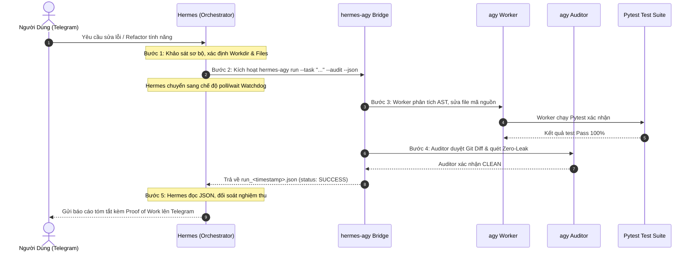

# 🤖 ĐẶC TẢ KIẾN TRÚC TỔNG QUẢN TỰ HÀNH HERMES & ANTIGRAVITY WORKER ENGINE

> **Tài liệu:** `10_AUTONOMOUS_ORCHESTRATION_HERMES_AGY_SPECIFICATION.md`
> **Bộ tài liệu:** Master System Architecture (`Documents/Structure`)
> **Mục tiêu:** Chuẩn hóa mô hình điều phối tự trị 100% kết hợp giữa **Hermes Agent (Bộ não Tổng quản / Orchestrator)** và **Antigravity CLI (Bàn tay Kỹ sư & Đôi mắt Kiểm toán / Worker & Auditor)**.
> **Nguyên tắc cốt lõi:** Phân định Quyền lực • Tự trị Tuyệt đối (YOLO/Headless) • Bất đồng bộ Chống treo (Watchdog) • Giao thức JSON Chuẩn hóa • Hiến pháp Zero-Leak.

---

## 📑 MỤC LỤC
1. [BỐI CẢNH & TẠI SAO CẦN MÔ HÌNH DUAL-ENGINE (WHY DUAL-ENGINE?)](#1-bối-cảnh--tại-sao-cần-mô-hình-dual-engine-why-dual-engine)
2. [KIẾN TRÚC HỆ THỐNG HAI TẦNG (TWO-TIER SYSTEM ARCHITECTURE)](#2-kiến-trúc-hệ-thống-hai-tầng-two-tier-system-architecture)
3. [BỘ 7 NGUYÊN TẮC HIẾN PHÁP VẬN HÀNH (7 CORE OPERATING CONSTITUTION)](#3-bộ-7-nguyên-tắc-hiến-pháp-vận-hành-7-core-operating-constitution)
4. [ĐẶC TẢ GIAO THỨC CẦU NỐI `hermes-agy` (TECHNICAL BRIDGE SPECIFICATION)](#4-đặc-tả-giao-thức-cầu-nối-hermes-agy-technical-bridge-specification)
5. [QUY TRÌNH TIÊU CHUẨN VẬN HÀNH SOP 5 (STANDARD OPERATING PROCEDURE 5)](#5-quy-trình-tiêu-chuẩn-vận-hành-sop-5-standard-operating-procedure-5)
6. [CƠ CHẾ BẢO VỆ CHỐNG TREO & KHẮC PHỤC SỰ CỐ (RESILIENCE & WATCHDOG)](#6-cơ-chế-bảo-vệ-chống-treo--khắc-phục-sự-cố-resilience--watchdog)
7. [CƠ CHẾ TỰ PHỤC HỒI & QUẢN TRỊ RÁC ĐỊNH KỲ (PERIODIC AUTO-HEALING & HYGIENE ENGINE)](#7-cơ-chế-tự-phục-hồi--quản-trị-rác-định-kỳ-periodic-auto-healing--hygiene-engine)
8. [TIÊU CHÍ NGHIỆM THU & BẢNG KIỂM TRA ĐỊNH KỲ (AUDIT & COMPLIANCE CHECKLIST)](#8-tiêu-chí-nghiệm-thu--bảng-kiểm-tra-định-kỳ-audit--compliance-checklist)

---

## 1. BỐI CẢNH & TẠI SAO CẦN MÔ HÌNH DUAL-ENGINE (WHY DUAL-ENGINE?)

Trong các hệ thống tự động hóa sử dụng AI Agent độc lập truyền thống, việc dồn toàn bộ trách nhiệm (từ nhận tin nhắn, quản lý trí nhớ dài hạn, đọc hiểu toàn bộ mã nguồn đến lập trình và chạy test) vào một mô hình duy nhất thường bộc lộ **4 giới hạn chí mạng**:

```text
┌─────────────────────────────────────────────────────────────────────────────┐
│                   HẠN CHẾ CỦA SINGLE AGENT TRUYỀN THỐNG                     │
│                                                                             │
│  [Agent Duy Nhất (Single LLM)]                                              │
│  ├── Context Drift: Quá tải token vì phải đọc hàng chục file cùng lúc       │
│  ├── Terminal Timeout: Bị ngắt kết nối (120s) khi chạy test suite lớn       │
│  ├── Hallucination: Tự sửa code nhưng không có bước kiểm duyệt độc lập      │
│  └── Single Point of Failure: Dễ rơi vào vòng lặp vô tận (Infinite Loops)    │
└─────────────────────────────────────────────────────────────────────────────┘
                                      │
                                      ▼
┌─────────────────────────────────────────────────────────────────────────────┐
│                 MÔ HÌNH PHỐI HỢP DUAL-ENGINE ĐỘC LẬP                        │
│                                                                             │
│   🧠 HERMES AGENT (Orchestrator)      🛠️ ANTIGRAVITY CLI (Worker/Auditor)    │
│   - Tiếp nhận lệnh từ Telegram/Slack   - Phân tích cú pháp AST chuyên sâu   │
│   - Quản lý trí nhớ & Kanban           - Lập trình đa file chuẩn xác        │
│   - Đóng gói Task Specification        - Chạy Pytest toàn diện              │
│   - Giám sát tiến trình ngầm           - Quét Zero-Leak & duyệt Git Diff    │
└─────────────────────────────────────────────────────────────────────────────┘
```

### Lợi ích cốt lõi của mô hình Dual-Engine:
1. **Triệt tiêu nghẽn Context:** Hermes chỉ giữ tóm tắt nhiệm vụ và trạng thái cấp cao, không bị ô nhiễm ngữ cảnh bởi hàng nghìn dòng code chi tiết.
2. **Loại bỏ Terminal Timeout:** Các tác vụ sửa code nặng được Antigravity thực thi ngầm bất đồng bộ, Hermes chỉ giám sát trạng thái qua tiến trình nền.
3. **Kiểm toán Chéo Hai Lớp (Dual-Eye Verification):** Antigravity sửa code và chạy test, Hermes đối soát nghiệm thu dựa trên dữ liệu JSON trả về trước khi báo cáo cho Người dùng.

---

## 2. KIẾN TRÚC HỆ THỐNG HAI TẦNG (TWO-TIER SYSTEM ARCHITECTURE)

Hệ thống được tổ chức phân tầng rõ ràng, đảm bảo tính đóng gói và độc lập:

```text
                               ┌──────────────────┐
                               │   NGƯỜI DÙNG     │
                               │  (Telegram UI)   │
                               └────────┬─────────┘
                                        │ (Tin nhắn tự nhiên)
                                        ▼
┌─────────────────────────────────────────────────────────────────────────────┐
│ 🧠 TẦNG 1: HERMES GATEWAY & ORCHESTRATION ENGINE                            │
│                                                                             │
│  ┌───────────────────────┐   ┌───────────────────────┐   ┌───────────────┐  │
│  │ Telegram Adapter      │   │ Long-term Memory      │   │ Kanban / Cron │  │
│  │ (Messaging Lifecycle) │   │ (SQLite & Honcho)     │   │ Task Manager  │  │
│  └───────────┬───────────┘   └───────────┬───────────┘   └───────┬───────┘  │
│              └───────────────────────────┼───────────────────────┘          │
│                                          ▼                                  │
│                               ┌───────────────────────┐                     │
│                               │ SOP 5 Task Packager   │                     │
│                               │ (Build Task Spec)     │                     │
│                               └──────────┬────────────┘                     │
└──────────────────────────────────────────┼──────────────────────────────────┘
                                           │ Gọi nền: hermes-agy run ...
                                           ▼
┌─────────────────────────────────────────────────────────────────────────────┐
│ 🌉 TẦNG TRUNG GIAN: BRIDGE & INTERFACE PROTOCOL                             │
│                                                                             │
│  ┌───────────────────────────────────────────────────────────────────────┐  │
│  │ Script: ~/.local/bin/hermes-agy                                       │  │
│  │ - Nhận tham số: --task, --workdir, --audit, --model, --json           │  │
│  │ - Kích hoạt agy headless detached process                             │  │
│  │ - Bọc và cấu trúc hóa kết quả ra ~/.hermes/agy_runs/run_<timestamp>.json│
│  └───────────────────────────────────────────────────────────────────────┘  │
└──────────────────────────────────────────┬──────────────────────────────────┘
                                           │ Khởi chạy headless
                                           ▼
┌─────────────────────────────────────────────────────────────────────────────┐
│ 🛠️ TẦNG 2: ANTIGRAVITY CLI EXECUTION ENGINE (WORKER & AUDITOR)              │
│                                                                             │
│  ┌─────────────────────────┐                   ┌─────────────────────────┐  │
│  │ 👷 agy Worker Instance  │ ──(Chỉnh sửa)──>  │ 📂 Workspace Codebase   │  │
│  │ (Code Editor / Multi-fn)│                   │ (/media/vpsg16gb/...)   │  │
│  └───────────┬─────────────┘                   └────────────┬────────────┘  │
│              │                                              │               │
│              ▼                                              ▼               │
│  ┌─────────────────────────┐                   ┌─────────────────────────┐  │
│  │ 🧪 Pytest Test Runner   │ <──(Kiểm thử)───  │ 🕵️ agy Auditor Instance  │  │
│  │ (Full Suite Execution)  │                   │ (Zero-Leak / Git Diff)  │  │
│  └─────────────────────────┘                   └─────────────────────────┘  │
└─────────────────────────────────────────────────────────────────────────────┘
```

---

## 3. BỘ 7 NGUYÊN TẮC HIẾN PHÁP VẬN HÀNH (7 CORE OPERATING CONSTITUTION)

Mọi hoạt động tương tác giữa Hermes và Antigravity CLI bắt buộc phải tuân thủ 7 nguyên tắc tối thượng sau:

### 1️⃣ Nguyên tắc Phân định Quyền lực (Role Isolation)
* **Hermes:** Đóng vai trò **Tổng quản & Giám sát (Architect & Reviewer)**. Nắm giữ ngữ cảnh hệ thống, phân rã yêu cầu thành Task Spec và nghiệm thu. Hermes **tuyệt đối không tự ý sửa code đa file**.
* **Antigravity CLI:** Đóng vai trò **Kỹ sư & Kiểm toán viên (Worker & Auditor)**. Độc quyền thực hiện việc chỉnh sửa mã nguồn, refactor file và chạy test suite.

### 2️⃣ Nguyên tắc Tự trị Tuyệt đối (Zero-Interaction / Headless Mode)
* Hermes phải kích hoạt chế độ **`--yolo`** để tự động phê duyệt các lệnh điều phối.
* Antigravity CLI phải chạy ở chế độ **`-p` (Prompt-only headless)** để loại bỏ toàn bộ các hộp thoại dừng chờ tương tác từ bàn phím (`y/n`).

### 3️⃣ Nguyên tắc Bất đồng bộ & Giám sát Chống treo (Async & Watchdog Lifecycle)
* Hermes tuyệt đối không gọi `agy` dạng blocking terminal thông thường.
* Mọi lệnh thực thi phải chạy ngầm (detached background), gán process ID và sử dụng cơ chế **`poll / wait`** có giới hạn timeout (Watchdog) để bảo vệ hệ thống không bị treo.

### 4️⃣ Nguyên tắc Giao thức Dữ liệu Chuẩn hóa (Structured JSON Protocol)
* Giao tiếp giữa hai tầng phải được đóng gói qua tệp JSON tinh gọn (`~/.hermes/agy_runs/run_*.json`).
* Hermes chỉ đọc các trường trạng thái: `status`, `worker_exit_code`, `duration_seconds`, `secret_scan`, `output_preview` thay vì nạp hàng nghìn dòng terminal text vào context.

### 5️⃣ Nguyên tắc Hiến pháp Bảo mật & Zero-Leak (Security Constitution)
* Tuân thủ 100% quy tắc trong `AGENTS.md` và `03_SECURE_ISOLATION_VAULT.md`.
* Tuyệt đối không in hoặc nhúng plaintext token, Private Key, OAuth secret vào tham số command-line hoặc prompt payload.
* Cầu nối `hermes-agy` tự động quét regex rò rỉ secret trước khi trả về kết quả `SUCCESS`.

### 6️⃣ Nguyên tắc Kiểm toán Độc lập (Second-Opinion / Dual-Eye Review)
* Khi `agy Worker` hoàn thành việc sửa code, hệ thống kích hoạt `agy Auditor` (với cờ `--audit`) để kiểm tra chéo Git Diff, đảm bảo không sinh ra lỗi logic mới hoặc vi phạm quy chuẩn kiến trúc.

### 7️⃣ Nguyên tắc Báo cáo dựa trên Bằng chứng (Evidence-Based Proof of Work)
* Mọi phản hồi nghiệm thu gửi về cho Người dùng phải đi kèm bằng chứng xác thực:
  - Tên các tệp đã sửa đổi trên đĩa cứng.
  - Tỷ lệ và số lượng bài test đã Pass / Fail.
  - Mã thoát (Exit Code: 0) và thời gian thực thi (duration).

---

## 4. ĐẶC TẢ GIAO THỨC CẦU NỐI `hermes-agy` (TECHNICAL BRIDGE SPECIFICATION)

### 4.1. Cấu trúc Lệnh CLI Cầu Nối
Cầu nối được cài đặt tại `/home/vpsg16gb/.local/bin/hermes-agy`:

```bash
hermes-agy run \
  --task "<Nội dung nhiệm vụ kỹ thuật chi tiết>" \
  --workdir "/media/vpsg16gb/HaRiDisk/Path/To/Project" \
  --audit \
  --json \
  --timeout 600
```

### 4.2. Bảng Tham số Cấu hình:
| Tham số | Kiểu dữ liệu | Bắt buộc | Mô tả |
| :--- | :--- | :---: | :--- |
| `--task` | String | **Có** | Đề bài kỹ thuật chi tiết chứa ngữ cảnh, mục tiêu và file trọng tâm |
| `--workdir` | Path | **Có** | Thư mục làm việc tuyệt đối của repository |
| `--audit` | Flag | Không | Kích hoạt phiên kiểm toán viên độc lập sau khi Worker hoàn tất |
| `--model` | String | Không | Model AI chỉ định cho Antigravity (Mặc định: Gemini 3.7 Flash) |
| `--json` | Flag | Không | Xuất kết quả nghiệm thu ra định dạng JSON |
| `--timeout` | Integer | Không | Thời gian timeout tối đa của Watchdog (Mặc định: 600s) |

### 4.3. Cấu trúc Tệp Kết quả Nghiệm thu JSON (`~/.hermes/agy_runs/run_<timestamp>.json`):
```json
{
  "status": "SUCCESS",
  "worker_exit_code": 0,
  "duration_seconds": 264.67,
  "workdir": "/media/vpsg16gb/HaRiDisk/Telegram_Command_Center",
  "secret_scan": {
    "clean": true,
    "issues": []
  },
  "audit": {
    "verdict": "APPROVED",
    "notes": "All modified files adhere to <= 150 lines and zero plaintext secrets."
  },
  "output_preview": "Modified sync_media_submodules/fleet_deployer.py and parser.py. Full test suite: 441 passed in 65.03s.",
  "error_preview": ""
}
```

---

## 5. QUY TRÌNH TIÊU CHUẨN VẬN HÀNH SOP 5 (STANDARD OPERATING PROCEDURE 5)

Quy trình 5 bước bắt buộc khi Hermes tiếp nhận một yêu cầu kỹ thuật:



---

## 6. CƠ CHẾ BẢO VỆ CHỐNG TREO & KHẮC PHỤC SỰ CỐ (RESILIENCE & WATCHDOG)

| Sự Cố Tiềm Ẩn | Cơ Chế Bảo Vệ Tự Động |
| :--- | :--- |
| **Terminal Timeout (120s)** | Tách tiến trình `agy` thành background process độc lập với PID riêng; Hermes chỉ kiểm tra trạng thái qua file lock/PID. |
| **Quá tải Token (Context Overflow)** | Hermes chỉ đọc tệp JSON tóm tắt 10–15 dòng thay vì đọc toàn bộ output terminal. |
| **Tranh chấp Ghi Đĩa (Race Condition)** | Áp dụng nguyên tắc **Sole-Writer**: Khi `agy` đang chạy, Hermes bị khóa quyền chỉnh sửa file trong repo đích. |
| **Vòng lặp Vô tận (Infinite Loops)** | Thiết lập cờ timeout cứng `--print-timeout 10m` và ngắt tiến trình tự động nếu vượt quá ngưỡng thời gian. |
| **Rò rỉ Secret trong Code mới** | Cầu nối `hermes-agy` tích hợp sẵn bộ lọc Regex quét kiểm tra token/secret trước khi trả về trạng thái `SUCCESS`. |

---

## 7. CƠ CHẾ TỰ PHỤC HỒI & QUẢN TRỊ RÁC ĐỊNH KỲ (PERIODIC AUTO-HEALING & HYGIENE ENGINE)

Sau một thời gian vận hành tự động, hệ thống dễ phát sinh các loại "rác kỹ thuật" (phiên não cũ, file worktree tạm, log tích tụ, drift cấu hình). Hệ thống tích hợp sẵn cỗ máy **Auto-Healing & Hygiene Engine** tự động chạy ngầm mỗi 6 giờ.

```text
┌─────────────────────────────────────────────────────────────────────────────┐
│                 HERMES-AGY PERIODIC AUTO-HEALING & HYGIENE ENGINE           │
│                                                                             │
│  ⏱️ SYSTEMD TIMER: hermes-agy-autoheal.timer (Chu kỳ: 00, 06, 12, 18:00)   │
│                                                                             │
│  1. 🧹 GARBAGE PURGE (Dọn Rác Hệ Thống):                                    │
│     • Xóa các phiên não tạm (>7 ngày) trong ~/.gemini/antigravity-cli/brain │
│     • Xoay vòng giữ tối đa 50 file log nghiệm thu trong ~/.hermes/agy_runs/ │
│     • Dọn sạch các thư mục worktree rác /tmp/hermes_worktree_*              │
│                                                                             │
│  2. 🔒 CONFIG AUTO-HEAL (Tự Sửa Lỗi Cấu Hình & Phân Quyền):                 │
│     • Tự động khôi phục permissionMode = "always-proceed" trong settings    │
│     • Tự động cấp quyền thực thi chmod +x cho cầu nối hermes-agy            │
│     • Đảm bảo đường dẫn biến môi trường $PATH luôn chuẩn xác                │
│                                                                             │
│  3. 🚦 GATEWAY & SERVICE WATCHDOG (Giám Sát Dịch Vụ):                       │
│     • Kiểm tra trạng thái hermes-gateway.service                            │
│     • Tự động restart service nếu phát hiện bị treo hoặc tắt ngầm           │
│                                                                             │
│  4. 🧪 FAST SMOKE TEST (Kiểm Thử Tự Động Định Kỳ):                          │
│     • Bắn lệnh test headless qua hermes-agy run để xác nhận toàn bộ         │
│       chuỗi mắt xích Hermes ➔ agy ➔ Gemini API hoạt động trơn tru (<10s).   │
└─────────────────────────────────────────────────────────────────────────────┘
```

### 7.1. Cấu hình Dịch vụ & Timer Định kỳ
* **Script thực thi:** `~/.local/bin/hermes-agy-autoheal` (Python $\le 150$ dòng).
* **Systemd Service:** `~/.config/systemd/user/hermes-agy-autoheal.service`
* **Systemd Timer:** `~/.config/systemd/user/hermes-agy-autoheal.timer`
  ```ini
  [Timer]
  OnCalendar=*-*-* 00,06,12,18:00:00
  Persistent=true
  ```

---

## 8. TIÊU CHÍ NGHIỆM THU & BẢNG KIỂM TRA ĐỊNH KỲ (AUDIT & COMPLIANCE CHECKLIST)

Khi đánh giá tính sẵn sàng của mô hình điều phối tự trị trên một máy chủ mới, bắt buộc phải thỏa mãn 100% các tiêu chí:

- [ ] Cầu nối `~/.local/bin/hermes-agy` đã được cấp quyền thực thi (`chmod +x`).
- [ ] Thư mục lưu trữ log `~/.hermes/agy_runs/` đã được khởi tạo và có quyền ghi.
- [ ] File [`HERMES_MASTER_PROMPT.md`](file:///home/vpsg16gb/.hermes/HERMES_MASTER_PROMPT.md) đã nạp đầy đủ quy trình **SOP 5** và nguyên tắc **Token Economics**.
- [ ] Skill [`antigravity-worker`](file:///home/vpsg16gb/.hermes/skills/software-development/antigravity-worker/SKILL.md) được đăng ký và nhận diện thành công bởi Hermes.
- [ ] Script tự phục hồi `~/.local/bin/hermes-agy-autoheal` đã được cài đặt và cấp quyền `chmod +x`.
- [ ] Systemd timer `hermes-agy-autoheal.timer` đã được kích hoạt (`active (waiting)`).
- [ ] Thử nghiệm lệnh headless `hermes-agy run --task "echo test" --json` hoàn tất với mã thoát `0` trong thời gian $\le 15$ giây.
- [ ] 100% các lệnh điều phối không làm rò rỉ secret ra file log hay terminal stdout.
